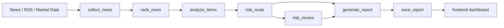

# Financial Agents

面向财经新闻的 **Market Intelligence Agentic Workflow**：基于 FastAPI + LangGraph 聚合多源新闻、分析事件影响、生成带证据链的市场观察报告。

本项目是个人学习和作品集项目，重点展示可解释 workflow、合规边界、证据链、trace 和 offline eval。它不是自动荐股系统，不做量化交易，不输出买卖建议，也不是生产级投研系统。

## What It Does

- 从 News API、RSS、市场数据接口收集候选新闻。
- 使用 LangGraph 串联 `collect_news -> rank_news -> analyze_items -> risk_route -> risk_review -> generate_report`。
- 输出 `market_signals`，每条包含 `supporting_articles`、风险原因、不确定性和证据摘要。
- 保留 legacy endpoints 和 legacy `recommendations` 字段，仅用于兼容，不作为推荐 demo 入口。
- 最终报告包含合规 disclaimer：本报告仅用于信息整理和研究参考，不构成投资建议。



## Safety And Secrets

- Do not commit `.env` or real API keys.
- `.env.example` files contain placeholders only.
- If a real key was ever committed, rotate it in the provider console.
- `.gitignore` ignores `.env`, `*.env`, `agent-python/.env`, `__pycache__/`, `.pytest_cache/`, and `.coverage`.

## Quick Start

```powershell
# 1. Backend env
copy agent-python\.env.example agent-python\.env
# Edit placeholders in agent-python\.env if you want real external APIs.

# 2. Install backend dependencies
cd agent-python
python -m venv .venv
.\.venv\Scripts\activate
pip install -r requirements.txt

# 3. Start FastAPI
uvicorn app.main:app --reload --host 127.0.0.1 --port 8010

# 4. Frontend
cd ..\frontend
python -m http.server 5173
# Open http://127.0.0.1:5173
```

Default backend port: `8010`.

Recommended LangGraph API:

```powershell
Invoke-RestMethod `
  -Method Post `
  -Uri http://127.0.0.1:8010/api/agent/market-pulse/langgraph `
  -ContentType "application/json" `
  -Body '{"query":"NVIDIA AI chips","max_items":5,"tickers":["NVDA"]}'
```

## Demo Flow

1. Register or login in the frontend.
2. Create a Watchlist and add ticker/topic/macro items.
3. Click “生成今日报告”.
4. Open the report detail page.
5. Review `market_signals`.
6. Expand each signal to inspect `supporting_articles`.
7. Check risk observation, uncertainty, source URL, and compliance status.
8. Run offline eval and inspect trace JSON.

## Eval

Offline benchmark is deterministic and does not require real API keys.

```powershell
python evals/run_eval.py
```

Outputs:

- `evals/report.md`
- `evals/report.json`

Metrics include:

- `relevance_at_5`
- `ticker_linking_accuracy`
- `risk_label_accuracy`
- `faithfulness_pass_rate`
- `compliance_violation_rate`
- `avg_latency_ms`
- `total_cases`
- `passed_cases`
- `failed_cases`

## Trace

Every LangGraph run creates a `trace_id`. The final API response includes:

- `trace_id`
- `trace_events`
- `trace_path`

Trace JSON is written under:

```text
agent-python/storage/langgraph_traces/{trace_id}.json
```

Each node trace records `node_name`, `start_time`, `end_time`, `duration_ms`, `input_count`, `output_count`, `error_code`, `error_message`, and `retry_count`.

## Report Job & Trace

Report generation runs as a background job so the UI and API can show progress, retry failed work, and inspect what happened after a run finishes. This is still the same FastAPI + LangGraph + SQLite architecture; it does not use Redis, Celery, Kafka, or PostgreSQL.

Job status flow:

```text
pending -> running -> succeeded
pending -> running -> failed
failed -> dead
pending/running -> cancelled
```

Each report job can now point to a database-backed report trace. A full trace records these steps when applicable:

```text
collect_news -> rank_news -> analyze_items -> risk_route -> risk_review -> generate_report -> compliance_guard -> save_report
```

`risk_review` is still recorded when skipped, with `metadata.skipped=true`. Each step stores status, timing, input/output counts, error text, and JSON metadata. User-facing reports must keep the compliance disclaimer and remain market observations, risk observations, evidence summaries, and research references only; they are not investment advice.

Progress and trace APIs:

```powershell
# Query job progress
Invoke-RestMethod -Headers @{Authorization="Bearer <token>"} `
  -Uri http://127.0.0.1:8010/api/report-jobs/<job_id>

# Cancel a pending/running job
Invoke-RestMethod -Method Post -Headers @{Authorization="Bearer <token>"} `
  -Uri http://127.0.0.1:8010/api/report-jobs/<job_id>/cancel

# Retry a failed/dead/cancelled job; returns the new job
Invoke-RestMethod -Method Post -Headers @{Authorization="Bearer <token>"} `
  -Uri http://127.0.0.1:8010/api/report-jobs/<job_id>/retry

# Query trace by job
Invoke-RestMethod -Headers @{Authorization="Bearer <token>"} `
  -Uri http://127.0.0.1:8010/api/report-jobs/<job_id>/trace

# Query trace by report
Invoke-RestMethod -Headers @{Authorization="Bearer <token>"} `
  -Uri http://127.0.0.1:8010/api/reports/<report_id>/trace
```

Manual verification:

1. Register/login and create a watchlist with at least one item.
2. Create a job with `POST /api/watchlists/{watchlist_id}/report-jobs`.
3. Run it with `POST /api/report-jobs/{job_id}/run` or start the worker.
4. Poll `GET /api/report-jobs/{job_id}` until `status=succeeded`.
5. Open `GET /api/report-jobs/{job_id}/trace` and verify step statuses, durations, counts, metadata, and errors.

Tests:

```powershell
pytest
```

## Validation

```powershell
python -m compileall agent-python
pytest
python evals/run_eval.py
```

## Legacy / Compatibility Only

These endpoints remain available for older demos or debugging, but the recommended portfolio path is `POST /api/agent/market-pulse/langgraph`.

- `POST /agent/analyze`
- `POST /agent/batch-analyze-news`
- `POST /agent/daily-brief`
- `POST /agent/market-pulse`
- `POST /api/market-pulse/agent-run`

## Compliance Statement

本项目仅用于公开信息整理、研究参考和工程能力展示，不构成投资建议、买卖建议、收益承诺或自动交易依据。
